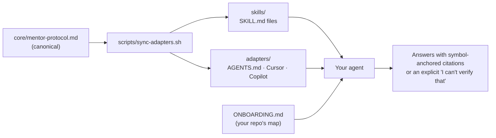

<p align="center">
  <h1 align="center">Codebase Mentor</h1>
</p>

<p align="center">
  <a href="https://github.com/erichare/codebase-mentor/actions/workflows/validate.yml"></a>
  <a href="https://github.com/erichare/codebase-mentor/releases"></a>
  <a href="https://erichare.github.io/codebase-mentor/"></a>
  <a href="LICENSE"></a>
</p>

<p align="center">
  <b>4 mentor modes · 1 onboarding generator · ~70 agents from one install · zero runtime code</b>
</p>

<p align="center">
  <a href="#install">Install</a> ·
  <a href="#what-you-get">What you get</a> ·
  <a href="#how-it-works">How it works</a> ·
  <a href="#does-it-work">Evaluation</a> ·
  <a href="#docs">Docs</a>
</p>

> **Every architecture or change-guidance claim must be backed by a symbol or file read in the
> current session.** Missing evidence is declared, never papered over. Source is the truth;
> `ONBOARDING.md` is the map.

AI coding agents answer "how does this repo work?" with confident guesses. Codebase Mentor pairs a
short, human-owned `ONBOARDING.md` (the map) with an enforced evidence protocol (the truth), so any
agent answers architecture questions with symbol-anchored citations from your *current* source — or
says plainly that it can't. It's a prompt artifact, not a service: nothing to run, nothing to host.

<p align="center">
  
</p>

## Install

Three ways in — pick one.

### Universal installer (~70 agents)

```bash
npx skills add erichare/codebase-mentor
```

Claude Code, Cursor, Codex, Copilot, OpenCode, and everything else the
[`skills`](https://github.com/vercel-labs/skills) CLI supports.

### Claude Code plugin

```
/plugin marketplace add erichare/codebase-mentor
/plugin install codebase-mentor@codebase-mentor
```

Adds `/codebase-mentor:onboard` and auto-updates with the marketplace.

### curl fallback (no npm, CI, air-gapped)

```bash
curl -fsSL https://raw.githubusercontent.com/erichare/codebase-mentor/main/install.sh | bash
```

Target a specific agent with `--agent claude|codex|cursor|copilot|agents-md|all`, or install into
the current repo with `--project`. The `agents-md` mode upserts a marker-fenced block into
`AGENTS.md`, covering every agent that reads that standard. Re-running is always safe.

### MCP server (any MCP client)

The [`mcp/`](mcp/) package ships a stdio MCP server with the protocol, ONBOARDING.md discovery, and
the mentor prompts — the client model does the reasoning; the server only supplies artifacts:

```json
{
  "mcpServers": {
    "codebase-mentor": {
      "command": "npx",
      "args": ["-y", "codebase-mentor-mcp"]
    }
  }
}
```

Full per-agent guide: [docs/INSTALL.md](docs/INSTALL.md) · team rollout:
[docs/TEAM_SETUP.md](docs/TEAM_SETUP.md).

## What you get

| Mode | Ask | Answer |
| --- | --- | --- |
| **Mentor** | *"How does X work?"* | Explanation from ONBOARDING.md anchors verified in live source, cited as `ClassName.methodName()` — never line numbers, which rot |
| **Change guide** | *"Where do I add Y?"* | Ordered checklist of real classes and methods, modeled on the nearest existing example in source |
| **Reconcile** | *"Is it still true that Z?"* | **Confirmed / Stale / Indeterminate** with the deciding symbol. The confident, evidenced *no* is the feature |
| **Scan** | *"Is our doc still accurate?"* | Every structural claim in ONBOARDING.md verified against current source — on demand, or [weekly in CI](examples/github-actions/onboarding-freshness.yml) |
| **Onboard** | *"This repo has no map"* | `/codebase-mentor:onboard` drafts the doc from live source and interviews you only for what source can't show — 2–4 hours of authoring becomes a ~30-minute review |

## Getting started in a repo

1. **No ONBOARDING.md?** Run `/codebase-mentor:onboard`, or author from the
   [template](template/ONBOARDING.md) with the [authoring guide](template/AUTHORING_GUIDE.md).
   This repo [dogfoods its own](ONBOARDING.md).
2. **Ask:** *"Where do I add X?"*
3. **Keep it fresh:** copy the [freshness-scan workflow](examples/github-actions/onboarding-freshness.yml)
   into `.github/workflows/` — drift files an issue instead of misleading the next engineer.

## How it works

One canonical protocol; every agent artifact is generated from it and drift-checked in CI.



- **The protocol** ([`core/mentor-protocol.md`](core/mentor-protocol.md)) defines the accuracy
  contract, the four operating modes, and the evidence-missing protocol. A ~2 KB
  [compact variant](core/mentor-protocol-compact.md) fits agents with tight instruction budgets.
- **The generator** ([`scripts/sync-adapters.sh`](scripts/sync-adapters.sh)) splices the protocol
  into each agent's native format. `--check` mode runs in CI, so generated files can never drift
  from the canonical source.
- **The doc** ([`template/ONBOARDING.md`](template/ONBOARDING.md)) is 400–800 words, seven
  sections: purpose, layer map, execution lifecycle, domain vocabulary, change recipes,
  high-signal files, known gotchas. Humans own it; agents are required to verify it.

## Does it work?

In a three-arm evaluation on the [Stargate Data API](https://github.com/stargate/jsonapi)
(39 command resolvers, five-layer pipeline):

| Setup | Avg. score (1–5) |
| --- | --- |
| Bare agent, source access only | 1.3 |
| Agent + ONBOARDING.md, no evidence protocol | 3.5 |
| **Agent + ONBOARDING.md + evidence protocol** | **4.7** |

The sharpest win: asked whether collection and table logic could share an implementation, the
source-only arm *recommended it* — the mentored arm refused, citing the precise failure modes in
`DocumentShredder.shred()`.

Scores are author-assigned against pre-written rubrics; [all raw outputs are published](evaluation/SCORECARD.md)
for blind re-scoring, and independent judging has not yet been run. Full story on the
[evaluation page](https://erichare.github.io/codebase-mentor/evaluation/).

## Docs

| Guide | |
| --- | --- |
| [Documentation site](https://erichare.github.io/codebase-mentor/) | The full docs, rendered |
| [Per-agent install](docs/INSTALL.md) | Every supported agent, step by step |
| [Team rollout](docs/TEAM_SETUP.md) | Adopting ONBOARDING.md across a team |
| [Authoring guide](template/AUTHORING_GUIDE.md) | Write a great ONBOARDING.md, with worked examples |
| [Example ONBOARDING.md files](onboarding/) | Stargate Data API, AstraPy, Langflow — real docs, real anchors |
| [Freshness scan in CI](examples/github-actions/onboarding-freshness.yml) | Copy-paste weekly drift check |
| [Evaluation scorecard](evaluation/SCORECARD.md) | Three-arm design, rubrics, raw outputs |
| [Changelog](CHANGELOG.md) | Release history |

## What's in this repo

| Area | Contents |
| --- | --- |
| [`core/`](core/) | The canonical mentor protocol (full + compact) — everything else is generated from it |
| [`skills/`](skills/) | Generated SKILL.md artifacts: the mentor + the onboard generator |
| [`adapters/`](adapters/) | Generated AGENTS.md snippet, Cursor rule, Copilot instructions block |
| [`scripts/`](scripts/) | `sync-adapters.sh` — regenerates all distribution artifacts; `--check` gates CI |
| [`mcp/`](mcp/) | Stdio MCP server (`codebase-mentor-mcp` on npm): protocol, ONBOARDING.md discovery, mentor prompts |
| [`template/`](template/) | The seven-section ONBOARDING.md template + authoring guide |
| [`docs/`](docs/) · [`site/`](site/) | Per-agent install / team guides · the MkDocs documentation site |
| [`examples/`](examples/) | Copy-paste GitHub Actions freshness-scan workflow |
| [`onboarding/`](onboarding/) | Real example ONBOARDING.md files |
| [`evaluation/`](evaluation/) | The three-arm evaluation scorecard |

<details>
<summary><b>Development</b> — contributing, releasing</summary>

<br>

Edit canonical sources (`core/`, `template/`), never generated files, then regenerate:

```bash
scripts/sync-adapters.sh          # regenerate skills/ and adapters/
scripts/sync-adapters.sh --check  # what CI runs
```

See [CONTRIBUTING.md](CONTRIBUTING.md) for the full workflow and release process, and
[SECURITY.md](SECURITY.md) for reporting vulnerabilities. Adapter contributions for new agents are
especially welcome.

</details>

---

<p align="center">
  <sub>MIT © <a href="https://github.com/erichare">Eric Hare</a> — for people who'd rather their agent cite the code than improvise it.</sub>
</p>
