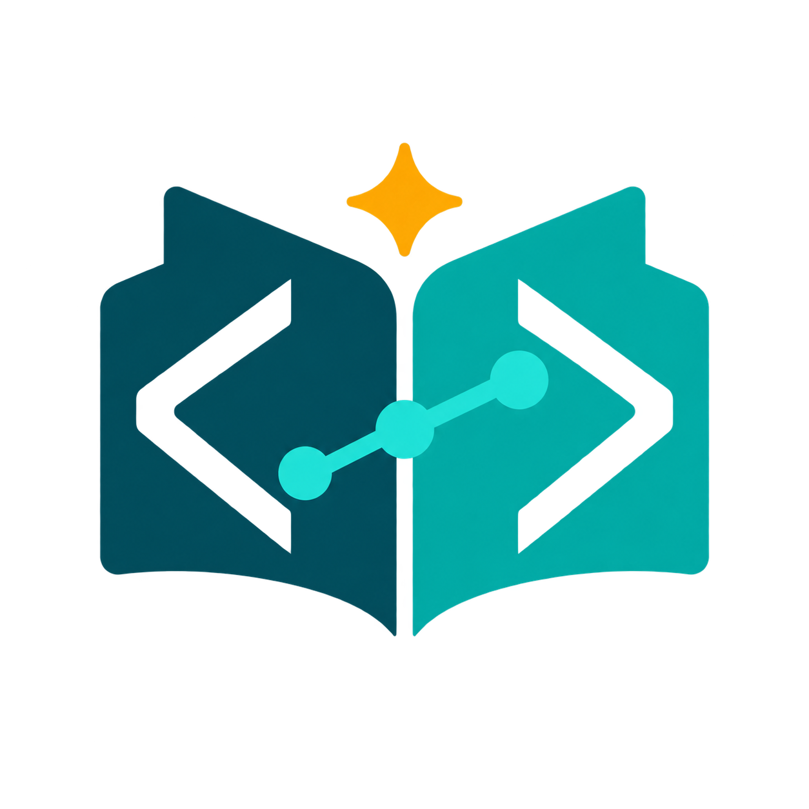

# Codebase Mentor

Version 1.2.2 by [JEStats](https://jestats.io). Understand unfamiliar code,
plan a change, and maintain onboarding documentation with source-backed answers.
The plugin contains two skills: **codebase-mentor** and **onboard**. It requires
no API key, database, background service, or separate MCP runtime.

## Start with a question

Open the repository you want to understand in your coding agent. Ask:

> Use codebase-mentor to trace one important execution path in this repository.
> Read the source, cite the relevant files and symbols, and flag what you cannot verify.

An ONBOARDING.md is optional. In Claude Code, invoke
`/codebase-mentor:codebase-mentor` to ask a question or
`/codebase-mentor:onboard` to draft a map. In Codex, select the skill by name or
ask to use **codebase-mentor** or **onboard** in a new session.

The skills guide your agent to inspect source. They do not guarantee correctness.
Review the cited evidence and any generated document before acting.

## Install and get help

- [Installation and troubleshooting](https://github.com/jestatsio/codebase-mentor/blob/main/docs/INSTALL.md)
- [Documentation](https://jestatsio.github.io/codebase-mentor/)
- [Source and releases](https://github.com/jestatsio/codebase-mentor)
- [Report an issue](https://github.com/jestatsio/codebase-mentor/issues)
- [Privacy policy](PRIVACY.md)

MIT licensed. See the bundled [LICENSE](LICENSE).
